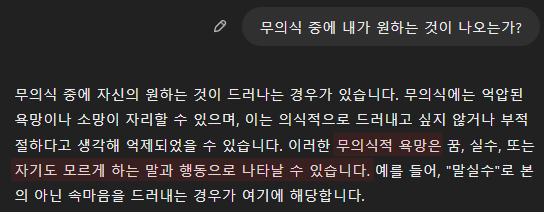
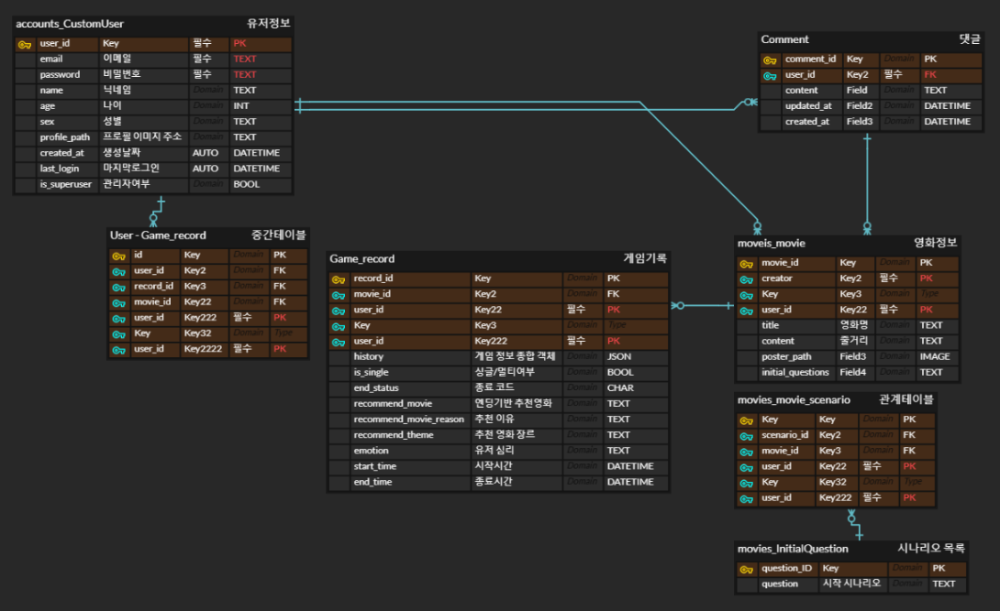
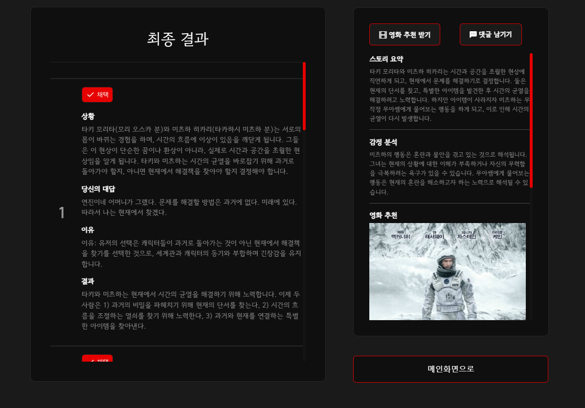
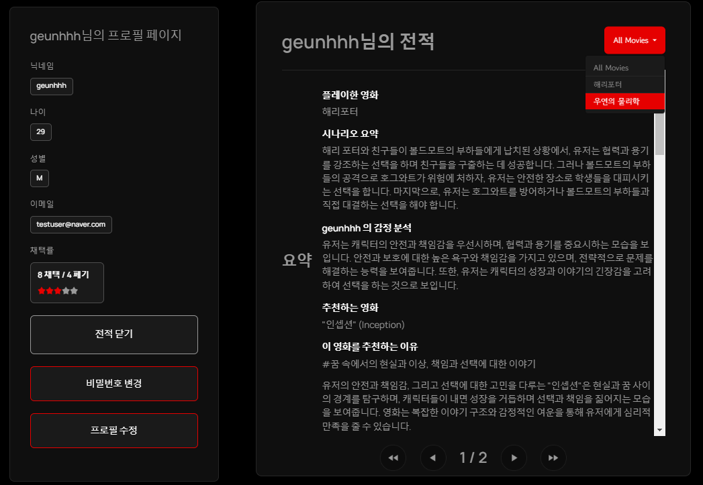

아, 제가 내용을 정리하면서 이미지를 누락했나 봅니다. 죄송합니다! 이미지를 포함한 버전을 다시 작성하겠습니다. 아래는 이미지를 포함한 개선된 README입니다.

---

# **🎮[ Type TO Ending ]🎮** - README

---

## 🚩 **목차**

1. [프로젝트 소개](#프로젝트-소개)
2. [팀원 정보 및 업무 분담 내역](#팀원-정보-및-업무-분담-내역)
3. [목표 서비스 구현 및 실제 구현 정도](#목표-서비스-구현-및-실제-구현-정도)
4. [데이터베이스 모델링 (ERD)](#데이터베이스-모델링-erd)
5. [영화 추천 알고리즘](#영화-추천-알고리즘)
   - [생성형 AI 활용 부분](#생성형-ai-활용-부분)
6. [핵심 기능](#핵심-기능)
   - [게임 → 영화 추천](#게임--영화-추천)
   - [무의식 분석](#무의식-분석)
   - [전적 확인 및 커스텀 영화 제작](#전적-확인-및-커스텀-영화-제작)
7. [기술 스택](#기술-스택)
8. [기타 (느낀점, 후기 등)](#기타-느낀점-후기-등)

---

## 1. 🎬 **프로젝트 소개**

**[Type TO Ending]**은 사용자 입력 기반으로 심리 분석을 수행하고, 이를 통해 개인화된 영화 추천과 커스텀 영화 제작 경험을 제공합니다.

- 사용자는 영화의 세계관에서 직접 **시나리오를 작성**하며 이야기를 진행합니다.
- 심리 분석 결과는 사용자의 감정, 무의식적인 욕구를 도출해 **추천 영화**를 제공합니다.
- 게임의 결과로 제공된 데이터를 바탕으로 **AI가 맞춤형 영화 대본**을 작성합니다.

---

## 1-1. ✨ **기획 배경**

- **a. 나는 어떤 영화를 보고 싶은걸까????**
  - 모르겠어. 나는 뭘 보고 싶은거지??
- **b. 어떻게 알 수 있을까??**
  
  - 즉, 원하는 것은 무의식에서 드러나기 마련!!!
   질문을 던졌을 때 그가 원하는 방향으로 사고하고 답변할 것이다..!!
  - 상황, 질문, 답변을 통해 인지하지 못했던 
  (`나도 몰랐던`)'내 취향의 영화'를 추천해보자
- **c. 어떤 방법으로??**
   🎮Gamifiction : Type to Ending🎮

---

## 2. 🎓 **팀원 정보 및 업무 분담 내역**

| 이름       | 역할         | 주요 업무 (기능별 업무 분담)                           |
| ---------- | ------------ | ------------------------------------------------------ |
| **김근휘** | **1번 팀장** | 영화 추천 알고리즘, 커스텀 영화 기능, 영화 데이터 준비 |
| **권동환** | **2번 팀장** | 프로젝트 기획, UI/UX 총괄, 회원 정보 관련 기능,        |

---

## 3. 🎯 **목표 서비스 구현 및 실제 구현 정도**

### **목표 서비스 구현**

- **영화 추천**: 심리 분석 기반의 맞춤형 영화 추천 제공.
- **커스텀 영화 제작**: 사용자의 데이터와 키워드로 영화 대본 생성.
- **게임 데이터 시각화**: 유저의 선택 기록과 분석 결과를 직관적으로 제공.

### **구현 정도**

- ✅ **영화 추천 알고리즘** 구현 및 테스트 완료.
- ✅ **LLM 기반 시나리오 분석** 알고리즘 완성.
- ✅ **UI/UX 디자인**과 화면 레이아웃 구축 완료.
- ✅ **ERD 데이터베이스 설계 및 구축** 완료.
- ✅ **커스텀 영화 제작** 기능 테스트 완료.
- 🚧 향후 개선 기능: LLM + RAG를 활용한 분석 및 추천 시스템 강화
- 🚧 향후 추가 기능: 멀티플레이 기능.

---

## 4. 📂 **데이터베이스 모델링 (ERD)**

### **ERD 설계**

  

---

## 5. 🧠 **영화 추천 알고리즘**

### **개요**

사용자 게임 데이터를 바탕으로 **LangChain**과 **OpenAI GPT**를 활용해, 심리 분석과 추천 영화를 도출하는 알고리즘입니다.

---

## 6. ✨ **핵심 기능**

### **0. 기본 기능**

- 회원가입, 로그인, 비밀번호 변경, 회원 정보 수정
- 배경 음악 온오프, 튜토리얼 툴바 지원

| 메인 화면 (로그인 전)               | 메인 화면 (로그인 후)            |
| ----------------------------------- | -------------------------------- |
|  |  |

| 프로필 화면                        | How to play 툴바            |
| ---------------------------------- | --------------------------- |
|  |  |

### **1. 게임 → 영화 추천**

- 사용자가 영화의 세계관을 기반으로 시나리오를 작성.
- 행동을 점수화하고, 적합성 여부를 판단하여 결과를 제공합니다.

| 대기실 화면                       | 대기실 화면 (영화 선택 후)      |
| --------------------------------- | ------------------------------- |
|  |  |

| 영화 선택 화면                        | 시나리오 작성 화면               |
| ------------------------------------- | -------------------------------- |
|  |  |

| 시나리오 결과 화면1              | 시나리오 결과 화면2            |
| -------------------------------- | ------------------------------ |
|  |  |

### **2. 무의식 분석 및 영화 추천**

- 작성된 유저의 시나리오 결과를 바탕으로 심리 상태를 분석하고, 그에 맞는 영화를 매칭.

| 시나리오 결과 화면1             | 영화 후기 작성                  |
| ------------------------------- | ------------------------------- |
|  |  |

### **3. 전적 확인 및 커스텀 영화 제작**

- 유저가 플레이한 기록과 분석 데이터를 시각화.
- AI를 활용해 유저의 선택 데이터를 바탕으로 독창적인 영화 대본 생성.

| 전적 확인 화면                    | 커스텀 영화 작성               |
| --------------------------------- | ------------------------------ |
|  |  |

---

## 7. 🛠️ 기술 스택

- Backend: Django, Django REST Framework
- Frontend: Vue.js, HTML/CSS, BootStrap
- Database: SQLite
- AI: OpenAI GPT (via LangChain)
- Deployment: git lab

## 8. 🌟 기타 (느낀점, 후기 등)

### 포부 (프로젝트 시작 전)
- **쉬엄쉬엄 하자. 건강이 최고다. 그러나 잠은 죽어서 자도 늦지 않다.**

### 팀원들의 소감

- 김근휘: "."
- 권동환: "."

### 향후 계획

1. 멀티 플레이 기능 구현 도전
2. AI 성능 향상을 위해 GPT 프롬프트 최적화 및 RAG 구성 진행.
