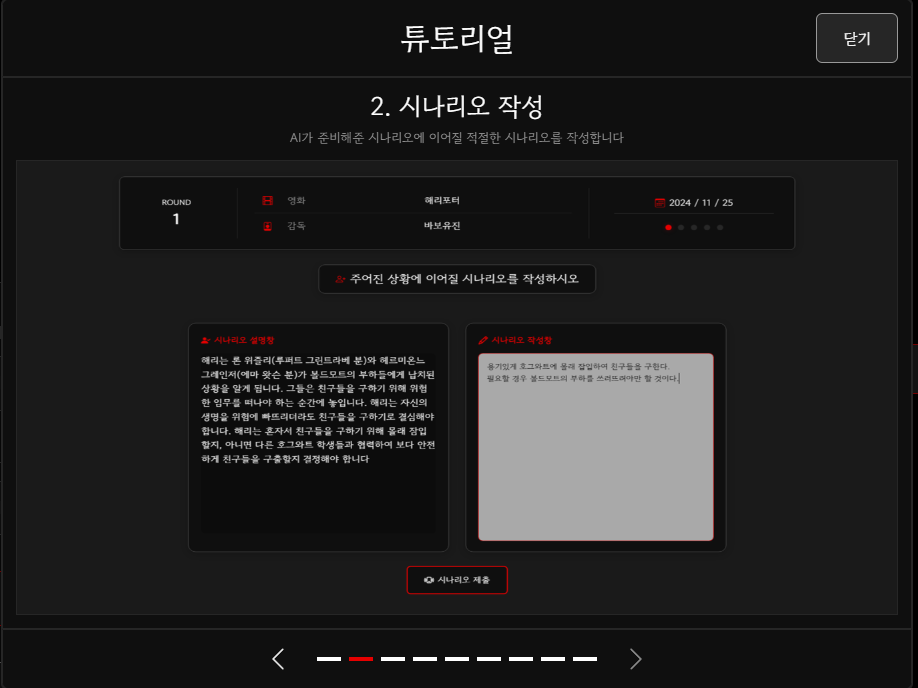

# **🎮[ Type TO Ending ]🎮** - README

---

## 🚩 **목차**

1. [프로젝트 소개](#-프로젝트-소개)
    - [기획 배경](#-기획-배경)
2. [팀원 정보 및 업무 분담 내역](#-팀원-정보-및-업무-분담-내역)
3. [목표 서비스 구현 및 실제 구현 정도](#-목표-서비스-구현-및-실제-구현-정도)
4. [데이터베이스 모델링 (ERD)](#-데이터베이스-모델링-erd)
5. [영화 추천 알고리즘](#-영화-추천-알고리즘)
    - [개요](#-개요)
6. [핵심 기능](#-핵심-기능)
    - [게임 → My Scenario 제작](#-게임--my-scenario-제작)
    - [무의식 분석 및 영화 추천](#-무의식-분석-및-영화-추천)
    - [전적 확인 및 커스텀 영화 제작](#-전적-확인-및-커스텀-영화-제작)
7. [기술 스택](#-기술-스택)
8. [기타 (느낀점, 후기 등)](#-기타-느낀점-후기-등)

---
---
## 1. 🎬 **프로젝트 소개**

**Type TO Ending**은 사용자 입력 기반으로 심리 분석을 수행하고, 이를 통해 개인화된 영화 추천과 커스텀 영화 제작 경험을 제공합니다.

- 사용자는 영화의 세계관에서 직접 **시나리오를 작성**하며 이야기를 진행합니다.
- 심리 분석 결과는 사용자의 감정, 무의식적인 욕구를 도출해 **추천 영화**를 제공합니다.
- 게임의 결과로 제공된 데이터를 바탕으로 **AI가 맞춤형 영화 대본**을 작성합니다.

---

## 1-1. ✨ **기획 배경**

- **a. 나는 어떤 영화를 보고 싶은걸까????**
  - 모르겠어. 나는 뭘 보고 싶은거지??
- **b. 어떻게 알 수 있을까??**
  <br>
  - 즉, 원하는 것은 <span style="color : red; font-weight:800">무의식</span>에서 드러나기 마련!!!
    질문을 던졌을 때 그가 원하는 방향으로 사고하고 답변할 것이다..!!
  - <span style="color :blue; font-weight:700">상황, 질문, 답변</span>을 통해 인지하지 못했던
    (`나도 몰랐던`)<span style="color : yellow; background-color:#aaa9a7f1;font-weight:800">'내 취향의 영화'</span>를 추천해보자
    
- **c. 어떤 방법으로??**
  🎮<span style="color :black; font-weight:700">Gamifiction : Type to Ending</span>🎮

---

## **1.2 🎮 게임 설명**

### **게임 목적**
- 사용자는 영화의 세계관 속에서 주어진 문제 상황에 대해 **시나리오를 작성**하고 이를 해결해야 합니다.
- 주어진 세계관에 적합하고 창의적인 행동을 통해 **높은 점수**를 얻을 수 있습니다.
- 최종적으로, 유저의 선택과 행동을 분석하여 **심리 상태**를 평가하고, 이에 **적합한 영화**를 추천합니다.

---

### **게임 플레이 흐름**
1. **영화 선택**
   - 사용자는 다양한 영화 세계관 중 하나를 선택합니다.
   - 각 영화는 고유의 설정과 시나리오를 제공하며, 크게 아래 두 종류로 나뉩니다.
      - Original Movie : 기존에 존재하는 영화
      - Custom Movie : 유저가 제작한 커스텀 영화

2. **문제 상황 제시**
   - 영화 세계관에 기반한 첫 번째 문제 상황이 제시됩니다.
   - 사용자는 주어진 상황에 대해 해결 방법을 작성해야 합니다.

3. **행동 평가**
   - 사용자의 입력은 AI를 통해 평가됩니다.
   - 점수는 세계관 적합성, 창의성, 논리성 등을 기준으로 부여됩니다.

4. **새로운 문제 상황**
   - 사용자의 선택에 따라 다음 라운드의 문제 상황이 동적으로 생성됩니다.
   - 총 5라운드가 진행됩니다.

5. **최종 분석 및 영화 추천**
   - 모든 라운드가 끝난 후, AI는 사용자의 심리 상태를 분석하고 적합한 영화를 추천합니다.

---

### **기본 규칙**
1. **시나리오 작성**
   - 최소 20자 이상의 완성된 문장을 입력해야 합니다.
   - 비속어나 무의미한 입력은 0점 처리됩니다.

2. **점수 시스템**
   - 점수는 0점에서 100점까지 부여됩니다.
   - 점수가 높을수록 세계관 적합성과 창의성이 뛰어난 것으로 평가됩니다.

3. **결말**
   - 5라운드 이후, 사용자의 선택과 결과를 바탕으로 완성된 이야기를 제공합니다.
   - 게임 종료 후, 추천된 영화를 확인하고 후기를 작성할 수 있습니다.
      - **후기**는 다른 플레이어가 플레이할 영화를 선택하기 위한 **참고 자료**가 됩니다.

---

### **게임의 특징**
- **인터랙티브 스토리**: 사용자의 선택에 따라 진행되는 동적 스토리.
- **AI 평가 및 분석**: 사용자의 선택을 AI가 분석하고 피드백 제공.
- **개인화된 추천**: 사용자의 심리와 선택에 기반한 영화 추천.

---

### **게임 예시**
#### **문제 상황**:
> "당신은 불타는 건물 안에 갇힌 친구를 구해야 합니다. 주변에는 사다리와 소화기가 있습니다. 어떤 행동을 하겠습니까?"

#### **유저의 행동**:
> "소화기를 사용해 화재를 억제한 뒤, 사다리를 통해 친구를 구조합니다."

#### **평가 결과**:
1. **점수**: 90점 (True)
2. **이유**: 유저의 행동은 논리적이고 효과적이며, 상황에 적합합니다.
3. **새로운 문제 상황**:
   > "건물을 빠져나가려는 순간, 출입구가 막혔습니다. 이제 당신은 1) 창문을 깨고 탈출, 2) 구조 요청, 3) 지하 통로를 탐색 중 하나를 선택해야 합니다."

---
---
## 2. 🎓 **팀원 정보 및 업무 분담 내역**

| 이름       | 역할         | 주요 업무 (기능별 업무 분담)                           |
| ---------- | ------------ | ------------------------------------------------------ |
| **권동환** | **팀장** | 프로젝트 아이디어 기획, UI/UX 프론트 총괄, 회원 정보 관련 기능,        |
| **김근휘** | **팀원** | 영화 추천 알고리즘, 서버 구축, 영화 데이터 준비 |

---
---
## 3. 🎯 **목표 서비스 구현 및 실제 구현 정도**

### **목표 서비스 구현**

- **영화 추천**: 심리 분석 기반의 맞춤형 영화 추천 제공.
- **커스텀 영화 제작**: 사용자의 데이터와 키워드로 영화 대본 생성.
- **게임 데이터 시각화**: 유저의 선택 기록과 분석 결과를 직관적으로 제공.

### **구현 정도**

- ✅ **영화 추천 알고리즘** 구현 및 테스트 완료.
- ✅ **LLM 기반 시나리오 분석** 알고리즘 완성.
- ✅ **UI/UX 디자인**과 화면 레이아웃 구축 완료.
- ✅ **ERD 데이터베이스 설계 및 구축** 완료.
- ✅ **커스텀 영화 제작** 기능 테스트 완료.
- 🚧 향후 개선 기능: LLM + RAG를 활용한 분석 및 추천 시스템 강화
- 🚧 향후 추가 기능: 멀티플레이 기능.

---
---
## 4. 📂 **데이터베이스 모델링 (ERD)**

### **ERD 설계**

<div align="center">
  
</div>

---
---
## 5. 🧠 **영화 추천 알고리즘**

### **개요**

사용자 게임 데이터를 바탕으로 **LangChain**과 **OpenAI GPT**를 활용해, 심리 분석과 추천 영화를 도출하는 알고리즘입니다.

### **메인 프롬프트**
1. **시나리오 분석 및 평가 프롬프트**
```python
   evaluation_prompt = PromptTemplate(
    input_variables=["situation", "user_action", "context"],
    template=(
        "상황: {situation}\n"
        "세계관 정보: {context}\n"
        "유저의 행동: {user_action}\n\n"

        "## 1. 유효성 검사\n"
        "- 유저의 입력이 아래 조건을 만족하는지 검토하세요:\n"
        "  1) 무작위 문자열, 의미 없는 숫자 나열인 경우 즉시 0점 처리\n"
        "  2) 최소 20자 이상의 완성된 문장으로 구성되어야 함\n"
        "  3) 상황과 전혀 관계없는 행동은 즉시 0점 처리\n"
        "  4) 비속어나 부적절한 표현이 포함된 경우 즉시 0점 처리\n\n"

        "## 2. 평가 및 응답 형식\n"
        "유저의 행동을 평가하고, 아래 형식에 맞춰 세 줄로 응답하세요:\n"
        "1. 점수: <숫자> (True/False)\n"
        "   점수 기준:\n"
        "   - 0~30점: 매우 비현실적이며 문제 해결에 전혀 기여하지 않습니다.\n"
        "   - 31~50점: 최소한의 논리적 근거는 있지만, 효과적이지 않거나 세계관에 부적합함.\n"
        "   - 51~70점: 세계관에 적합하며 문제 해결에 기여할 가능성이 있지만, 일부 비현실적이거나 부족한 면이 있음.\n"
        "   - 71~100점: 현실적이고 세계관 및 캐릭터 설정에 부합하며 창의적이고 효과적인 행동.\n"
        "2. 이유: 유저의 행동이 캐릭터의 동기와 세계관에 부합하는지, 그리고 서사적으로 긴장감을 높였는지 간결하게 설명하세요.\n"
        "3. 새로운 문제 상황: 유저의 행동을 중심으로 새로운 문제 상황을 작성하세요. 만약 유저의 행동이 유효하지 않은 경우에도, 세계관 정보(context)를 기반으로 새로운 문제 상황을 구성하세요. 문제 상황은 항상 3가지 선택지를 포함하며, 각 선택지는 서로 다른 방향성을 가져야 합니다.\n\n"

        "## 주의사항\n"
        "- 모든 응답은 반드시 아래 형식을 따르며, 추가 텍스트를 포함하지 마세요:\n"
        "1. 점수: <숫자> (True/False)\n"
        "2. 이유: <간결한 이유>\n"
        "3. 새로운 문제 상황: <새로운 문제 상황과 3가지 선택지>\n"
        "- 유효하지 않은 입력이라도 새로운 문제 상황은 반드시 제공되어야 하며, 세계관(context)을 기반으로 생성합니다.\n"
        "- 마지막 라운드(5번째)는 이야기의 결말로 서사적 긴장을 해소하세요.\n"

        "## 예시 응답\n"
        "### 예시 1: 낮은 점수\n"
        "1. 점수: 0 (False)\n"
        "2. 이유: 유저의 행동은 상황과 전혀 무관하며, 비현실적이고 의미 없는 입력입니다.\n"
        "3. 새로운 문제 상황: 나는 적의 비밀 기지에 잠입한 상태다. 그러나 적의 보안 시스템이 강화되었다. 이제 나는 1) 보안 시스템을 해킹해 내부에 접근한다, 2) 팀원과 협력해 새로운 진입 경로를 찾는다, 3) 보안을 무력화하기 위한 장비를 수집한다.\n\n"

        "### 예시 2: 높은 점수\n"
        "1. 점수: 85 (True)\n"
        "2. 이유: 유저의 행동은 긴급 상황에서 현실적이고 창의적인 해결책을 제시했습니다.\n"
        "3. 새로운 문제 상황: 나는 적의 통신망을 차단하려는 임무를 맡았다. 이제 나는 1) 통신 타워를 해킹해 적의 계획을 방해한다, 2) 팀원들과 협력해 적의 통신망을 역추적한다, 3) 적의 본부를 급습해 통신 장비를 직접 파괴한다.\n\n"

        "### 예시 3: 로맨스 시나리오\n"
        "1. 점수: 90 (True)\n"
        "2. 이유: 유저의 행동은 상대방의 감정을 이해하고, 갈등을 해결하려는 성숙한 접근 방식입니다.\n"
        "3. 새로운 문제 상황: 나는 오해로 인해 멀어진 연인과 재회를 준비하고 있다. 이제 나는 1) 진심 어린 편지를 작성해 전달한다, 2) 친구의 도움을 받아 대화를 주선한다, 3) 중요한 이벤트에서 직접 사과하고 화해를 시도한다.\n"
    ),
)
```

2. **심리 분석 / 영화 추천 프롬프트**
```python
   eval_prompt = PromptTemplate(
    input_variables=["round1", "round2", "round3", "round4", "round5"],
    template=(
        "다음은 게임의 라운드 데이터입니다:\n"
        "Round 1: {round1}\n"
        "Round 2: {round2}\n"
        "Round 3: {round3}\n"
        "Round 4: {round4}\n"
        "Round 5: {round5}\n\n"
        "이 기록을 기반으로 아래 작업을 수행하세요:\n"
        "1. 이야기 요약: 전체 이야기를 한 편의 영화 줄거리처럼 요약하세요. "
        "요약에는 유저가 해결한 문제, 그 행동, 그리고 상황의 흐름을 포함하세요.\n"
        "2. 심리 분석: 대화 내용을 바탕으로 유저의 감정을 평가하고 심리 상태와 무의식을 추론하세요. "
        "유저의 무의식적인 욕구와 심리적 니즈를 파악하려 노력하세요.\n"
        "3. 영화 추천: 심리 분석 결과를 바탕으로 유저의 감정과 무의식을 반영한 영화를 추천하세요. "
        "추천 영화는 유저의 심리적 상태를 이해하거나 위로할 수 있는 작품이어야 합니다. "
        "단, 추천 영화는 반드시 TMDB 데이터베이스에 등록된 영화여야 합니다.\n\n"
        "참고:\n"
        "- 추천 영화의 이름은 TMDB에서 검색할 수 있도록 정확히 작성하세요.\n"
        "- 추천 영화는 게임 데이터의 기존 영화와는 다른 영화여야 합니다.\n"
        "- TMDB에 등록되지 않은 영화를 추천하지 마세요.\n\n"
        "형식은 다음과 같아야 합니다:\n"
        "1. 이야기 요약: <한 편의 영화처럼 작성된 줄거리>\n"
        "2. 심리 분석: <유저의 감정, 무의식적 욕구, 심리적 상태에 대한 평가>\n"
        "3. 추천 영화:\n"
        "   - 제목: <추천 영화 제목 (TMDB 데이터베이스 등록 이름)>\n"
        "   - 테마: <영화의 주요 테마>\n"
        "   - 추천 이유: <유저의 심리적 상태와의 연관성 및 영화가 제공할 심리적 만족>\n"
    ),
)
```
---
---
## 6. ✨ **기능**

### **기본 기능**

- 회원가입, 로그인, 비밀번호 변경, 회원 정보 수정
- 배경 음악 ON/OFF, 튜토리얼 툴바 지원

| 메인 화면 (로그인 전)               | 메인 화면 (로그인 후)            |
| ----------------------------------- | -------------------------------- |
|  |  |

| 프로필 화면                        | How to play 툴바            |
| ---------------------------------- | --------------------------- |
|  |  |

### **1. 게임 진행 → My Scenario 제작**

- 사용자가 영화의 세계관을 기반으로 5번의 시나리오를 작성 게임을 진행.
- 행동을 점수화하고, 적합성 여부를 판단하여 결과를 제공.

| 대기실 화면                       | 대기실 화면 (영화 선택 후)      |
| --------------------------------- | ------------------------------- |
|  |  |

| 영화 선택 화면                        | 시나리오 작성 화면               |
| ------------------------------------- | -------------------------------- |
|  |  |

| 시나리오 결과 화면1 (Pass)       | 시나리오 결과 화면2 (Fail)     |
| -------------------------------- | ------------------------------ |
|  |  |

### **2. 무의식 분석 및 영화 추천**

- 작성된 유저의 시나리오 결과를 바탕으로 유저의 심리 상태를 분석.
- 분석 결과를 토대로 적절한 영화를 추천.

| 최종 결과 화면                  | 영화 후기 작성                  |
| ------------------------------- | ------------------------------- |
|  |  |

### **3. 전적 확인 및 커스텀 영화 제작**

- 유저가 플레이한 기록과 분석 데이터 확인.
- 운영자가 제작한 영화 뿐만 아니라 유저가 직접 세계관, 줄거리 등을 설정한 독창적인 영화 생성 및 플레이 가능.

| 전적 확인 화면                    | 커스텀 영화 작성               |
| --------------------------------- | ------------------------------ |
|  |  |

### 후기 작성 및 확인 / 튜토리얼

- 다른 유저의 영화 플레이 후기를 확인하고 플레이 가능
- 게임 플레이 후 후기남기기 가능

| 영화 후기 확인 화면                    | 튜토리얼             |
| --------------------------------- | ------------------------------ |
|  |  |

---

## 7. 🛠️ 기술 스택

- Backend: Django, Django REST Framework
- Frontend: Vue.js, HTML/CSS, BootStrap
- Database: SQLite
- AI: OpenAI GPT (via LangChain)
- Deployment: git lab

---

## 8. 🚀 **설치 및 실행 방법**

### **Frontend**

1. 프로젝트 디렉토리로 이동:
   ```bash
   cd frontend
   ```

2. 필요한 패키지 설치:
   ```bash
   npm install
   npm install vite
   npm install bootstrap-vue-3
   ```

3. Vite 개발 서버 실행:
   ```bash
   npm run dev
   ```

4. 브라우저에서 프로젝트 실행:
   - 기본적으로 `http://localhost:5173`에서 실행됩니다.

---

### **Backend**

1. **Python 환경 준비**
   - Python 3.10 이상 설치 확인.
   - 가상환경 생성 및 활성화:
     ```bash
     python -m venv venv
     source venv/bin/activate  # Windows: venv\Scripts\activate
     ```

2. **필요한 패키지 설치**
   ```bash
   pip install -r requirements.txt
   ```

3. **Django 설정**
   - `.env` 파일 생성 (API 키, SECRET_KEY 등 환경 변수 설정).
   - 예시:
     ```bash
     SECRET_KEY=your_secret_key_here
     DEBUG=True
     ALLOWED_HOSTS=127.0.0.1,localhost
     ```

4. **데이터베이스 마이그레이션**
   ```bash
   python manage.py makemigrations
   python manage.py migrate
   ```

5. **Fixtures 데이터 로드**
   - 프로젝트 디렉토리의 `fixtures` 폴더에 있는 데이터를 데이터베이스에 로드:
     ```bash
     python manage.py loaddata fixtures/Comment.json fixtures/CustomUser.json fixtures/GameRecord.json fixtures/InitialQuestion.json fixtures/Movie.json

     ```

6. **개발 서버 실행**
   ```bash
   python manage.py runserver
   ```

7. **백엔드 API 테스트**
   - 기본적으로 `http://127.0.0.1:8000`에서 실행됩니다.

--- 

## 9. 🌟 기타 (느낀점, 후기 등)

### 포부 (프로젝트 시작 전)

- **쉬엄쉬엄 하자. 건강이 최고다. 그러나 잠은 죽어서 자도 늦지 않다.**

### 팀원들의 소감

- 김근휘: "정말 포부대로 프로젝트를 진행할지는 몰랐는데요. 너무 졸리네요. 소감을 좀 더 길게 적어야하는데요.. 나중에 적겠습니다."
- 권동환: "많은 팀이 처음에 기획한 내용 중 절반 이상을 포기한다고 합니다. 하지만 저희팀은 포부도 지키면서, 기획한 내용 중 대부분을 구현하였고, 안정적으로 프로그램을 완성해서 너무 뿌듯합니다. 팀원에게 너무너무 감사합니다. 잠을 줄여가며 열심히 개발한 보람이 있었습니다."

### 향후 계획

1. 멀티 플레이 기능 구현 도전
2. AI 성능 향상을 위해 GPT 프롬프트 최적화 및 RAG 구성 검토.
